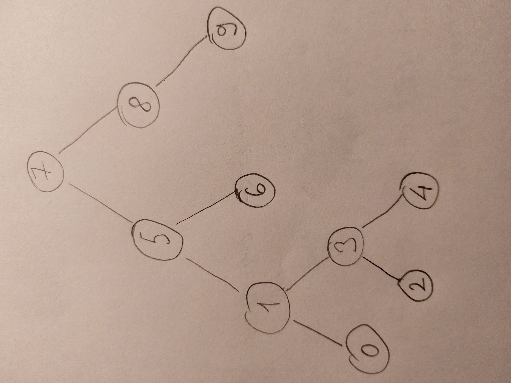

# Binary-Search-Tree Projesi

[7, 5, 1, 8, 3, 6, 0, 9, 4, 2] dizisinin Binary-Search-Tree aşamalarını yazınız.

- Dizinin 1. elemanı olan **7** henüz root bulunmadığı için root olarak belirlenir.
- Dizinin 2. elemanı olan 5 root ile kıyaslanır. 5 root'tan küçük olduğu için ve root'un henüz left node'u bulunmadığı için root'un left node'u olarak yazılır.
- Dizinin 3. elemanı olan 1 root ile kıyaslanır. 1 root'tan küçük olduğu için root'un left node'u ile kıyaslanır. 1 5'ten de küçük olduğu için 5'in left node'u olarak yazılır.
- Dizinin 4. elemanı olan 8 root ile kıyaslanır. 8 root'tan büyük olduğu ve root'un right node'u henüz bulunmadığı için root'un right node'u olarak yazılır.
- Dizinin 5. elemanı olan 3 root ile kıyaslanır. 3 root'tan küçük olduğu için root'un left node'u olan 5 ile kıyaslanır. 3 5'ten küçük olduğu için 5'in left node'u olan 1 ile kıyaslanır. 3 1'den büyük olduğu ve 1'in right node'u olmadığı için 1'in right node'u olarak yazılır.
- Dizinin 6. elemanı olan 6 root ile kıyaslanır. 6 root'tan küçük olduğu için root'un left node'u ile kıyaslanır. 6 5'ten büyük olduğu için ve henüz 5'in right node'u bulunmadığı için 5'in right node'u olarak yazılır.
- Dizinin 7. elemanı olan 0 root ile kıyaslanır. 0 root'tan küçük olduğu için root'un left node'u ile kıyaslanır. 0 5'ten küçük olduğu için 5'in left node'u ile kıyaslanır. 0 1'den küçük olduğu ve 1'in henüz left node'u bulunmadığı için 1'in left node'u olarak yazılır.
- Dizinin 8. elemanı olan 9 root ile kıyaslanır. 9 7'den büyük olduğu için root'un right node'u ile kıyaslanır. 9 8'den büyük olduğu ve 8'in henüz right node'u bulunmadığı için 8'in right node'u olarak belirlenir.
- Dizinin 9. elemanı olan 4 root ile kıyaslanır. 4 7'den küçük olduğu için root'un left node'u ile kıyaslanır. 4 5'ten küçük olduğu için 5'in left node'u ile kıyaslanır.
  4 1'den büyük olduğu için 1'in right node'u ile kıyaslanır. 4 3'ten büyük olduğu için ve henüz 3'ün right node'u bulunmadığı için 3'ün rigth node'u olarak belirlenir.
- Dizinin 10. elemanı olan 2 root ile kıyaslanır. 2 7'den küçük olduğu için root'un left node'u ile kıyaslanır. 2 5'ten küçük olduğu için 5'in left node'u ile kıyaslanır. 2 1'den büyük olduğu için 1'in right node'u ile kıyaslanır. 2 3'ten küçük olduğu için ve henüz 3'ün left node'u bulunmadığı için 3'ün left node'u olarak belirlenir.

